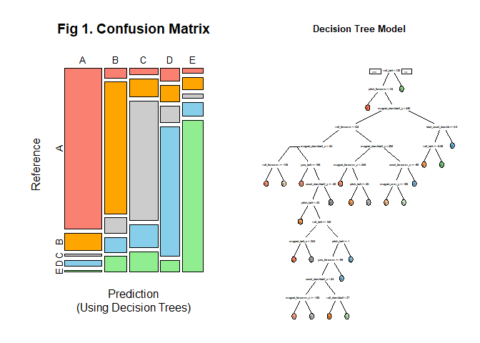
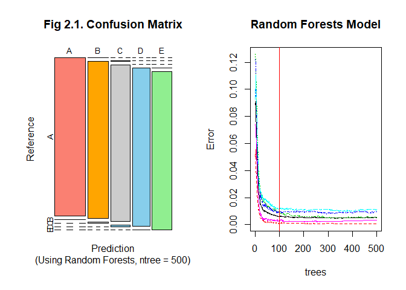
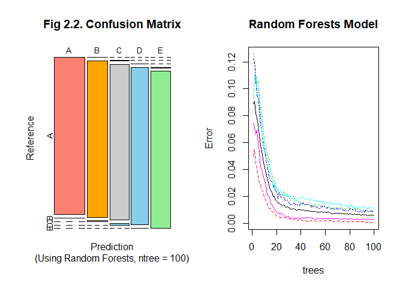
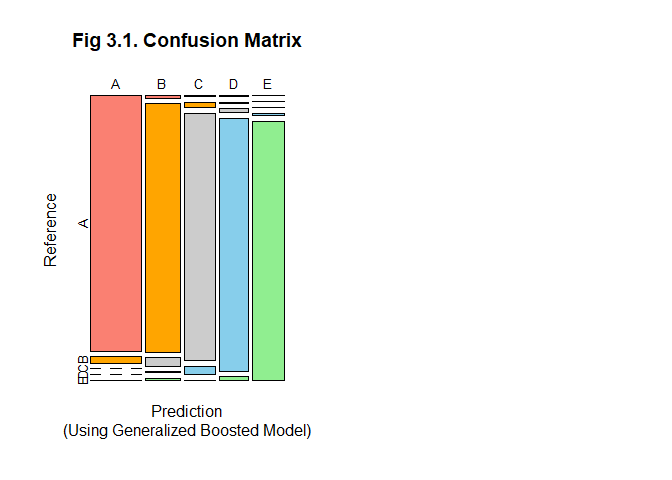
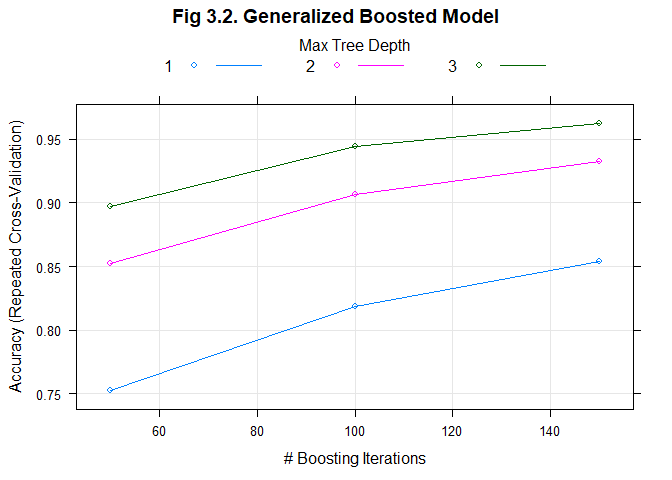

Background
----------

Using devices such as *Jawbone Up*, *Nike FuelBand*, and *Fitbit* it is
now possible to collect a large amount of data about personal activity
relatively inexpensively. These type of devices are part of the
quantified self movement - a group of enthusiasts who take measurements
about themselves regularly to improve their health, to find patterns in
their behavior, or because they are tech geeks. One thing that people
regularly do is quantify how *much* of a particular activity they do,
but they rarely quantify *how well they do it*. In this project, your
goal will be to use data from accelerometers on the belt, forearm, arm,
and dumbell of 6 participants. They were asked to perform barbell lifts
correctly and incorrectly in 5 different ways. More information is
available from the website here:
<http://web.archive.org/web/20161224072740/http:/groupware.les.inf.puc-rio.br/har>
(see the section on the Weight Lifting Exercise Dataset).

Executive Summary
-----------------

In this course project, I will use machine learning to predict the
manner in which the participants did the exercise. I will perform data
cleaning, partitioning, and variable selection. Then I will use the
`classe` variable in the sub-training set to build three prediction
models. I will then select the best model, based on accuracy, out of
sample error, and calculation efficiency. In summary, I have selected my
best model that's using **Random Forests** because of its accuracy and
less computationally exhaustive.

Load Dependencies
-----------------

    library(caret); library(ggplot2)
    library(rpart); library(rpart.plot)
    library(knitr); library(randomForest)

Load Train and Test Sets
------------------------

    training <- read.csv("https://d396qusza40orc.cloudfront.net/predmachlearn/pml-training.csv", na.strings = c("NA", "#DIV/0!", ""))
    testing <- read.csv("https://d396qusza40orc.cloudfront.net/predmachlearn/pml-testing.csv", na.strings = c("NA", "#DIV/0!", ""))

Data Partitioning
-----------------

    set.seed(123)
    inSubTrain <- createDataPartition(training$classe, p = 3/4, list = F)
    subTrain <- training[inSubTrain,]
    subTest <- training[-inSubTrain,] # Validation data set
    dim(subTrain); dim(subTest)

    ## [1] 14718   160

    ## [1] 4904  160

Data Pre-Processing and Feature Selection
-----------------------------------------

Exclude variables with NA values exceeding 50% of the total rows of the
subTrain data set

    na_percent <- sapply(subTrain, function(x) sum(length(which(is.na(x))))/length(x))
    exclTable <- data.frame(na_percent)
    exclTable["NAabove50pct"] <- exclTable$na_percent > 0.5

Exclude non-predictor variables (columns 1-7)

    exclTable["nonpredictor"] <- F; exclTable$nonpredictor[1:7] <- T

Exclude variables with Zero- and Near Zero-Variance

    exclTable["nzv"] <- nearZeroVar(subTrain, saveMetrics = T)$nzv
    exclTable["exclude"] <- exclTable$NAabove50pct | exclTable$nonpredictor | exclTable$nzv

Apply variable exclusion to all data sets

    subTrain <- subTrain[,-(which(exclTable$exclude))]
    subTest <- subTest[,-(which(exclTable$exclude))]
    testing <- testing[,-(which(exclTable$exclude))]

Model Fits and Prediction
-------------------------

In this section, I will be using three prediction model fits and then
select the best model, based on accuracy, out of sample error, and
calculation efficiency.

**1. Using Decision Trees** The result of this model is easy to
interpret but without proper cross-validation, the model can be
over-fitted especially with large number of variables such as our train
data here.

    set.seed(123)
    begtime <- Sys.time()
    modFit1 <- rpart(classe ~ ., data = subTrain, method = "class")
    endtime <- Sys.time()
    duration <- endtime - begtime
    pred1 <- predict(modFit1, subTest, type = "class")
    confmat1 <- confusionMatrix(pred1, subTest$classe)
    table1 <- confmat1$table

    par(mfrow = c(1,2))
    plot(confmat1$table, col = c("salmon", "orange", "grey80", "skyblue", "lightgreen"),
         main = "Fig 1. Confusion Matrix", sub = "(Using Decision Trees)", cex = 0.8)
    prp(modFit1, box.palette = "auto", main = paste("Decision Tree Model"))

<table>
<caption>Table 1. Confusion Matrix (Decision Tree): Accuracy = 0.7486 ; Error = 0.2514 ; Model Fit Process Time = 3.55 seconds</caption>
<thead>
<tr class="header">
<th></th>
<th align="right">A</th>
<th align="right">B</th>
<th align="right">C</th>
<th align="right">D</th>
<th align="right">E</th>
</tr>
</thead>
<tbody>
<tr class="odd">
<td>A</td>
<td align="right">1237</td>
<td align="right">131</td>
<td align="right">16</td>
<td align="right">44</td>
<td align="right">15</td>
</tr>
<tr class="even">
<td>B</td>
<td align="right">45</td>
<td align="right">598</td>
<td align="right">72</td>
<td align="right">67</td>
<td align="right">71</td>
</tr>
<tr class="odd">
<td>C</td>
<td align="right">39</td>
<td align="right">102</td>
<td align="right">683</td>
<td align="right">134</td>
<td align="right">115</td>
</tr>
<tr class="even">
<td>D</td>
<td align="right">51</td>
<td align="right">64</td>
<td align="right">65</td>
<td align="right">499</td>
<td align="right">46</td>
</tr>
<tr class="odd">
<td>E</td>
<td align="right">23</td>
<td align="right">54</td>
<td align="right">19</td>
<td align="right">60</td>
<td align="right">654</td>
</tr>
</tbody>
</table>

**2. Using Random Forests** Because random forest algorithm
automatically bootstrap by default, we can expect a better model
accuracy.

    set.seed(123)
    modFit2 <- randomForest(classe ~ ., data = subTrain, ntree = 500)
    pred2 <- predict(modFit2, subTest, type = "class")
    confmat2 <- confusionMatrix(pred2, subTest$classe)
    table2 <- confmat2$table

    par(mfrow = c(1,2))
    plot(confmat2$table, col = c("salmon", "orange", "grey80", "skyblue", "lightgreen"),
         main = "Fig 2.1. Confusion Matrix", sub = "(Using Random Forests, ntree = 500)", cex = 0.8)
    plot(modFit2, main = "Random Forests Model"); abline(v = 100, col = "red")

Notice that in **Fig2.1**, considerably good accuracy can already be
achieved at `ntrees = 100`, so I re-modelled (shown in **Fig2.2**) and
got a fairly faster computation time and achieved the same accuracy.

    set.seed(123)
    begtime <- Sys.time()
    modFit2 <- randomForest(classe ~ ., data = subTrain, ntree = 100)
    endtime <- Sys.time()
    duration <- endtime - begtime
    pred2 <- predict(modFit2, subTest, type = "class")
    confmat2 <- confusionMatrix(pred2, subTest$classe)
    table2 <- confmat2$table

    par(mfrow = c(1,2))
    plot(confmat2$table, col = c("salmon", "orange", "grey80", "skyblue", "lightgreen"),
         main = "Fig 2.2. Confusion Matrix", sub = "(Using Random Forests, ntree = 100)", cex = 0.8)
    plot(modFit2, main = "Random Forests Model")

<table>
<caption>Table 2. Confusion Matrix (Random Forests): Accuracy = 0.9953 ; Error = 0.0047 ; Model Fit Process Time = 14.45 seconds</caption>
<thead>
<tr class="header">
<th></th>
<th align="right">A</th>
<th align="right">B</th>
<th align="right">C</th>
<th align="right">D</th>
<th align="right">E</th>
</tr>
</thead>
<tbody>
<tr class="odd">
<td>A</td>
<td align="right">1394</td>
<td align="right">1</td>
<td align="right">0</td>
<td align="right">0</td>
<td align="right">0</td>
</tr>
<tr class="even">
<td>B</td>
<td align="right">1</td>
<td align="right">946</td>
<td align="right">6</td>
<td align="right">0</td>
<td align="right">0</td>
</tr>
<tr class="odd">
<td>C</td>
<td align="right">0</td>
<td align="right">2</td>
<td align="right">848</td>
<td align="right">8</td>
<td align="right">0</td>
</tr>
<tr class="even">
<td>D</td>
<td align="right">0</td>
<td align="right">0</td>
<td align="right">1</td>
<td align="right">793</td>
<td align="right">1</td>
</tr>
<tr class="odd">
<td>E</td>
<td align="right">0</td>
<td align="right">0</td>
<td align="right">0</td>
<td align="right">3</td>
<td align="right">900</td>
</tr>
</tbody>
</table>

**3. Using Generalized Boosted Model** To check whether it is still
possible to optimize the processing speed in the random forest model
`modFit2`, let's apply tree boosting methods with repeated cross
validation `repeatedcv` as computational nuance. With 5 folds of
test/training splits, and repeats = 1.

    set.seed(123)
    begtime <- Sys.time()
    fitCtrl <- trainControl(method = "repeatedcv", number = 5, repeats = 1)
    modFit3 <- train(classe ~ ., data = subTrain, method = "gbm",
                     trControl = fitCtrl, verbose = F)
    endtime <- Sys.time()
    duration <- endtime - begtime
    pred3 <- predict(modFit3, subTest)
    confmat3 <- confusionMatrix(pred3, subTest$classe)
    table3 <- confmat3$table

    par(mfrow = c(1,2))
    plot(confmat3$table, col = c("salmon", "orange", "grey80", "skyblue", "lightgreen"),
         main = "Fig 3.1. Confusion Matrix", sub = "(Using Generalized Boosted Model)", cex = 0.8)
    par(mfrow = c(1,1))

    plot(modFit3,
         main = "Fig 3.2. Generalized Boosted Model")

<table>
<caption>Table 3. Confusion Matrix (GBM): Accuracy = 0.9625 ; Error = 0.0375 ; Model Fit Process Time = 8.28 seconds</caption>
<thead>
<tr class="header">
<th></th>
<th align="right">A</th>
<th align="right">B</th>
<th align="right">C</th>
<th align="right">D</th>
<th align="right">E</th>
</tr>
</thead>
<tbody>
<tr class="odd">
<td>A</td>
<td align="right">1374</td>
<td align="right">34</td>
<td align="right">0</td>
<td align="right">0</td>
<td align="right">3</td>
</tr>
<tr class="even">
<td>B</td>
<td align="right">11</td>
<td align="right">894</td>
<td align="right">30</td>
<td align="right">3</td>
<td align="right">9</td>
</tr>
<tr class="odd">
<td>C</td>
<td align="right">5</td>
<td align="right">17</td>
<td align="right">812</td>
<td align="right">28</td>
<td align="right">2</td>
</tr>
<tr class="even">
<td>D</td>
<td align="right">4</td>
<td align="right">3</td>
<td align="right">12</td>
<td align="right">765</td>
<td align="right">12</td>
</tr>
<tr class="odd">
<td>E</td>
<td align="right">1</td>
<td align="right">1</td>
<td align="right">1</td>
<td align="right">8</td>
<td align="right">875</td>
</tr>
</tbody>
</table>

Conclusion
----------

I have chosen the superior model that's using **Random Forests
`ntrees = 100`** because of its better accuracy (compared to `modFit1`
and `modFit3`). `modFit3` is faster but sacrifices about **3%**
accuracy. So I used **Random Forests** `modFit2` in order to predict on
the Test Data in the next section. Applying this model achieved 100%
prediction accuracy in the Course Project Prediction quiz.

Predicting on the Test Data
---------------------------

Here are the answers to the Course Project Prediction quiz.

    data.frame(Answers = predict(modFit2, testing, type = "class"))

    ##    Answers
    ## 1        B
    ## 2        A
    ## 3        B
    ## 4        A
    ## 5        A
    ## 6        E
    ## 7        D
    ## 8        B
    ## 9        A
    ## 10       A
    ## 11       B
    ## 12       C
    ## 13       B
    ## 14       A
    ## 15       E
    ## 16       E
    ## 17       A
    ## 18       B
    ## 19       B
    ## 20       B
